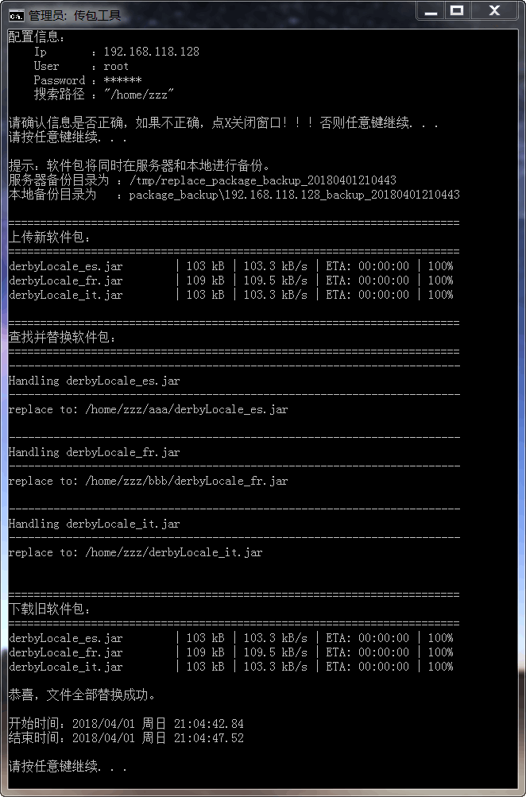

# 简介  

传包工具，自动将jar、war文件替换掉服务器上指定目录中的同名文件。  

# 原理  

1. 对于jar包，按名称搜索文件，找到后进行替换。  
2. 对于war包，先按名称搜索文件，找到后进行替换。再去掉后缀(.war)，搜索目录，将原目录压缩备份后删除，将新包解压到相应位置。(这么实现的原因是有些WAR包在部署后会被自动解压成同名的目录)  

# 使用  

1. 配置`传包-配置.ini`里面的参数。  
2. 将要替换的jar包和war包，放到`package_send`目录下。  
3. 双击执行`传包.bat`。  

# 截图  

  
